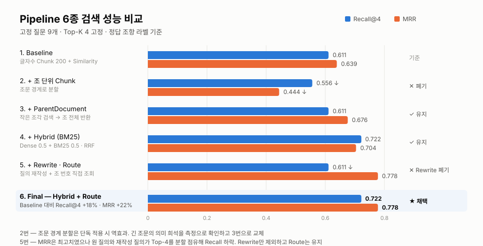
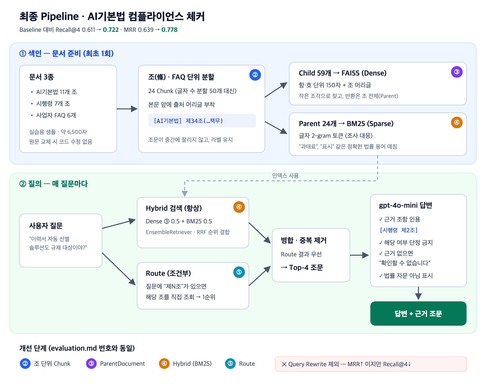

# AI기본법 컴플라이언스 체커 (RAG)

> 법무팀 없는 AI 기업이 기획 단계에서 **자사 서비스의 법적 의무를 근거 조문과 함께** 확인하는 RAG 토이 프로젝트.
> Baseline 포함 **6개 Pipeline을 동일 질문셋으로 측정·비교**하고, 효과 없는 개선은 근거를 기록해 폐기.

<br>

## 결과



<br>

## 측정에서 나온 판단

<table>
<tr><td width="33%" valign="top">

**① 가정이 틀렸음을 측정으로 확인**

조문 경계로 Chunk를 나누면 좋아질 것이라 예상

→ Recall@4 **0.611 → 0.556 하락**

원인은 긴 조문의 의미 희석

→ ParentDocument로 교체, MRR 0.444 → 0.676 회복

</td><td width="33%" valign="top">

**② 지표가 오른 개선을 제외**

Rewrite 적용 시 MRR 최고치 0.778

그러나 Recall 0.722 → **0.611 하락**

원인은 원 질의와 재작성 질의의 Top-4 분할 점유

→ Top-K 고정 조건에서는 손해. Rewrite 제외, Route만 유지

</td><td width="33%" valign="top">

**③ 남은 실패를 원인까지 추적**

"고영향 인공지능이 뭐야?" — 6개 Pipeline 전부 실패

FAQ 질문 문장이 거리 0.50으로 최근접, 정답 정의 조항은 0.80

→ 검색 실패가 아니라 **질문↔조문 문체 차이**. 다음 후보는 HyDE

</td></tr>
</table>

**④ 구현 중 발견한 버그 2건**

| 증상 | 원인 | 조치 |
|---|---|---|
| 하위 질의가 3개면 각 질의의 1위만 Top-4 진입 | Rewrite 결과를 순위 교차로 병합 | RRF 병합으로 변경 |
| Route로 1위에 올린 조문이 후순위로 밀림 | 중복 제거가 마지막 등장 위치 기준 정렬 | 첫 등장 순서 유지 → MRR 0.704 → 0.778 |

<br>

## 문제 정의

| | |
|---|---|
| **분산** | AI기본법은 추상적 표현으로 작성되고, 법률·시행령·가이드라인에 흩어지며, 조문 간 상호 참조 |
| **언어 불일치** | 사용자는 사업 언어("채용 솔루션", "벌금") · 법은 법률 언어("채용 판단에 활용되는 고영향 인공지능", "과태료") |
| **목표** | ① 관련 조문을 찾아 인용하며 답변 ② 근거가 없으면 답하지 않음 ③ 해당 여부는 단정하지 않고 "가능성"으로만 표현 |

### 생성 결과 확인

| 질문 | 결과 | |
|---|---|---|
| 이력서 자동 선별 채용 솔루션도 규제 대상? | 시행령 제2조 인용, "해당할 가능성이 높습니다" (개선 전에는 무관한 제35조 인용) | ✅ |
| 생성형 챗봇 고지 의무 + 과태료 | 고지 의무는 제31조로 정확, 과태료 제43조 누락 — Retrieval 실패가 답변 누락으로 연결 | ⚠️ |
| 미국 AI 규제와 비교하면? | "제공된 문서에서 확인할 수 없습니다" | ✅ |

전 답변에 법률 자문이 아니라는 면책 문구 부착.

<br>

## 구조



| 항목 | 값 |
|---|---|
| Embedding / LLM | `text-embedding-3-small` / `gpt-4o-mini` (temperature=0) |
| Vector Store | FAISS |
| Retriever | ParentDocument + BM25 Hybrid + Route |
| Top-K | 4 (전 Pipeline 동일) |
| 질문셋 | 고정 10개 (Retrieval 평가는 문서에 없는 질문 제외한 9개) |

상세 — 평가 조건·질문별 결과 [results/evaluation.md](results/evaluation.md) · 설계 근거 [results/design.md](results/design.md) · 실행 로그 [results/run_log.txt](results/run_log.txt)

<br>

## 실행

```bash
uv sync
cp .env.example .env   # OPENAI_API_KEY 입력
uv run --locked python src/capstone_compare.py
```

- Python 3.11, uv 필요
- 출력 — 질문별 6개 Pipeline의 Top-4와 Recall/RR, 요약 표, 최종 Pipeline 답변 3개

<br>

## 데이터

- `data/` — 법률 11개 조, 시행령 7개 조, FAQ 6개, 총 6,541자
- **실제 법률 구조를 참고해 작성한 실습용 샘플.** 조문 번호·기준이 실제와 다를 수 있음
- 실제 적용 시 국가법령정보센터 Open API로 교체 필요 (법률 54개 조 규모 → 정답 라벨 재매핑·재평가 필요)

## 한계

| 항목 | 내용 | 보완 방향 |
|---|---|---|
| 질문셋 규모 | 9개 — 표본이 작아 지표 변동 큼 | 20개 이상으로 확대 |
| 복합 질문 | "고지 의무 + 과태료"에서 두 번째 주제(제43조) 누락 | 하위 질의별 Top-k 할당 또는 Reranker |
| 교차참조 | 제34조가 제33조를 참조해도 자동 확장하지 않음 | 참조 조문 추적 |
| 문체 차이 | 질문형과 선언문의 임베딩 거리 (위 ③) | HyDE |

---

SK AI Leader Academy (SKALA) 과정 중 과제로 작성 · 2026.09
